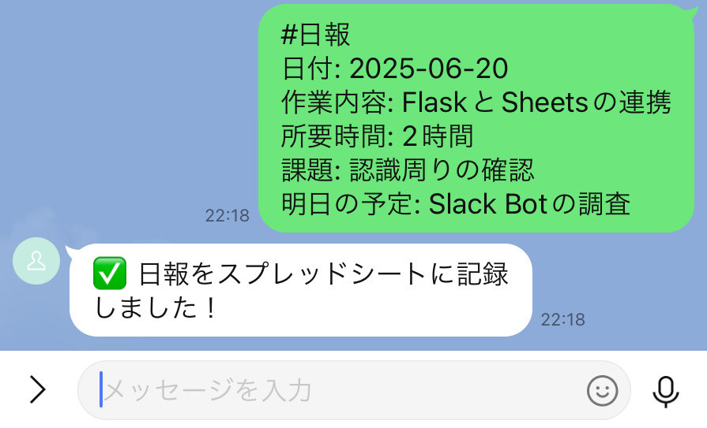
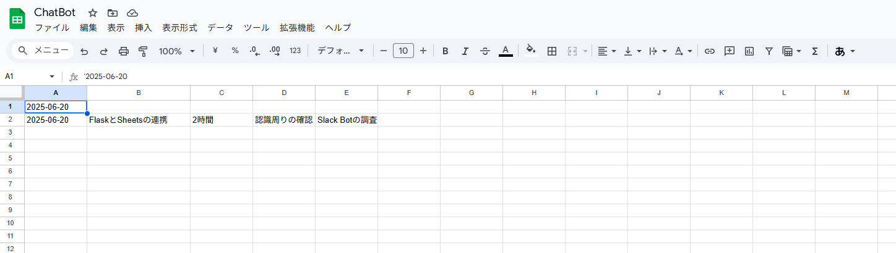
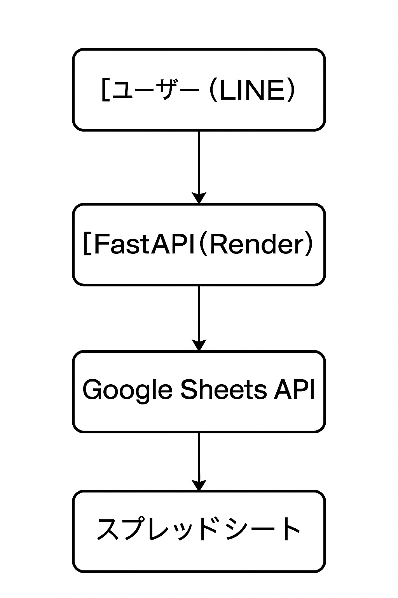

# 📅 LINE × Googleスプレッドシート 日報Bot

[](https://www.python.org/)
[](https://fastapi.tiangolo.com/)
[](https://developers.google.com/sheets/api)
[](https://render.com/)

---

## 📌 概要

このBotは、**LINEで送信した日報を、Googleスプレッドシートに自動記録**するWebアプリです。  
Python製FastAPIサーバーとLINE Messaging API、Google Sheets APIを活用し、**個人利用に特化した日報管理ツール**として構築しています。

---

## 🛠 使用技術

| 技術名               | 説明                                       |
|----------------------|--------------------------------------------|
| Python 3.11          | メイン言語                                 |
| FastAPI              | 高速なAPIフレームワーク                     |
| LINE Messaging API   | LINEユーザーからのメッセージ受信／返信       |
| Google Sheets API    | スプレッドシートに自動で記録                |
| gspread              | Pythonでのスプレッドシート操作               |
| Render               | デプロイ環境（無料／永続ホスティング対応）  |

---

## 💡 主な機能

✅ LINEから日報を送るだけで自動で記録  
✅ 送信フォーマットはカジュアル（定型不要）  
✅ サーバー側で自動的に「日付」を記録  
✅ Googleスプレッドシートで履歴をいつでも確認可能  

### ✏️ 入力フォーマット例（LINE）

```
日報
作業内容：データ分析
所要時間：2h
課題：処理が遅い
明日：改善策の検討
```

## 📱 LINEでの動作イメージ

以下のように、LINEで日報メッセージを送信すると、自動でGoogleスプレッドシートに反映されます。




### 📄 出力（スプレッドシート）

| 日付       | 作業内容   | 所要時間 | 課題           | 明日の予定         |
|------------|------------|----------|----------------|--------------------|
| 2025/06/20 | データ分析 | 2h       | 処理が遅い      | 改善策の検討        |

## 📄 出力（スプレッドシート）イメージ

Googleスプレッドシートのイメージ。



---

## 📷 アーキテクチャ



---

## ⚙️ セットアップ手順

### 1. `.env` を作成（Renderにも設定）

```env
LINE_CHANNEL_ACCESS_TOKEN=xxxxxxxx
LINE_CHANNEL_SECRET=xxxxxxxx
SPREADSHEET_ID=xxxxxxxxxxxxxxxxxxxxxxx
GOOGLE_APPLICATION_CREDENTIALS=credentials.json
```

### 2. ライブラリインストール

```bash
pip install -r requirements.txt
```

### 3. ローカル実行

```bash
uvicorn main:app --host 0.0.0.0 --port 8000
```

---

## 🚀 デプロイ（Render）

1. Renderで新規Web Serviceを作成  
2. `main.py` を起動エントリとして指定  
3. ビルドコマンド：`pip install -r requirements.txt`  
4. Start Command：`python main.py`  
5. 環境変数は `.env` 相当をRender側で登録  
6. `credentials.json`はGitHub経由では非公開管理（Render Secret Files推奨）

---

## 🧩 今後の拡張予定

- [ ] LINE SDK v3対応
- [ ] 日報テンプレートの柔軟解析（自然言語対応）
- [ ] 毎日定時通知「今日の日報忘れてませんか？」
- [ ] CSVエクスポート／Google Drive連携

---

## 🧑‍💻 作者・背景

日々の開発記録を手軽に管理したいと思い、自分専用の**軽量日報Bot**として開発しました。  
LINEを使っていてGoogleスプレッドシートでの記録が得意な方におすすめの構成です。

---

## 📄 ライセンス

このプロジェクトは [MIT License](LICENSE) のもと公開されています。

---

✉  Mall:   [Adress](tkagawa218@gmail.com)  
            
---

## 🔗 リンク集

- 📘 [LINE Messaging API 公式ドキュメント](https://developers.line.biz/ja/)
- 📗 [gspread GitHub](https://github.com/burnash/gspread)
- 🌐 [Render (デプロイ環境)](https://render.com/)
- ⚡ [FastAPI 公式サイト](https://fastapi.tiangolo.com/)
